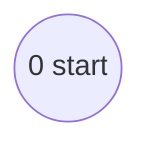
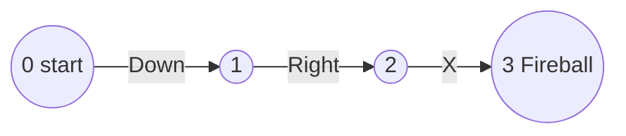
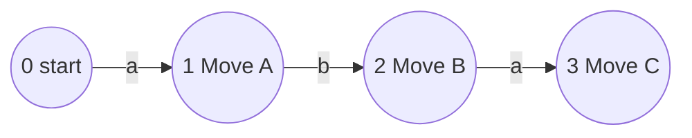
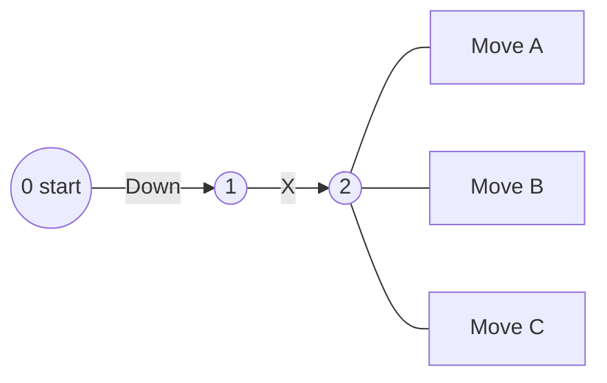
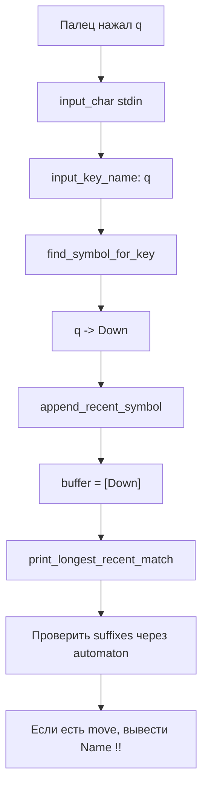
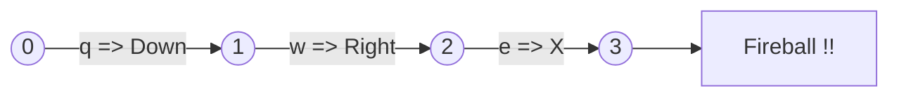

# ft_ality: автомат, который научился драться

Художественная книга-защита для человека, который почти не знает OCaml, но хочет объяснить проект так, чтобы другие захотели сделать его сами.

---

## Как пользоваться этой книгой

Эта книга не просто пересказывает код. Она готовит тебя к защите.

Если времени мало, прочитай:

1. Пролог.
2. Главы 1-8.
3. Раздел "Речь на защите за 5 минут".
4. Раздел "Вопросы, которые могут задать".

Если хочешь реально понять проект, читай всё подряд. Здесь есть и история, и схемы, и OCaml с нуля, и разбор файлов из текущей версии проекта:

```text
src/main.ml
src/grammar.ml
src/automaton.ml
src/keyboard_input.ml
Makefile
```

Главная мысль, которую надо вынести:

> ft_ality - это не игра. Это маленький мозг, который превращает список combo в карту дорог, а потом по нажатым клавишам идёт по этой карте и узнаёт приёмы.

---

# Часть I. История

## Пролог. Ночь перед защитой

Представь терминал как тёмный тренировочный зал.

На стене висит список приёмов:

```text
Fireball; Down, Right, X
Iceball; Down, Right, Y
Ground Slam; Down, Down, B
```

Где-то в углу стоит студент 42 и смотрит на это как на древнюю табличку.

Сначала кажется, что надо написать файтинг. Потом оказывается: нет, надо написать кое-что интереснее. Надо написать программу, которая умеет узнавать последовательности.

Не "просто сравнить строку".

Не "if input = Down Right X".

А построить автомат.

Автомат - это как карта комнат. Ты стоишь в комнате 0. Нажал `Down` - перешёл в комнату 1. Нажал `Right` - перешёл в комнату 2. Нажал `X` - оказался в комнате, где на стене написано:

```text
Fireball !!
```

И вот тут проект оживает.

## Глава 1. Что вообще просит subject

Subject говорит: сделай тренировочный режим файтинга.

Программа должна:

1. Получить путь к grammar-файлу.
2. Прочитать из него правила combo.
3. Построить finite-state automaton.
4. Показать key mapping.
5. Ждать нажатий клавиш.
6. Как только combo собрано, вывести имя приёма.

Пример из нашего проекта:

```text
% ./ft_ality grammars/small.gmr
Key mappings:
q -> Down
w -> Right
e -> X
r -> Y
t -> B
Press mapped keys to execute moves immediately.
Exit keys: Esc, Ctrl-D.
----------------------
```

Пользователь нажимает:

```text
q w e
```

Но Enter не нужен. Нажатия читаются сразу. Программа видит:

```text
Down, Right, X
```

И выводит:

```text
Fireball !!
```

Это и есть сердце проекта.

## Глава 2. Grammar-файл - тетрадь тренера

Файл `grammars/small.gmr` выглядит так:

```text
Fireball; Down, Right, X
Iceball; Down, Right, Y
Ground Slam; Down, Down, B
```

Слева от `;` - название приёма.

Справа от `;` - кнопки, которые надо нажать.

Если объяснять школьнику:

> Grammar-файл - это список рецептов. Чтобы приготовить Fireball, нужны ингредиенты Down, Right, X. Чтобы приготовить Iceball, нужны Down, Right, Y.

В коде одно правило описано так:

```ocaml
type rule = {
  buttons : Automaton.symbol list;
  move_name : string;
}
```

Это OCaml record. То есть структура с полями.

По-человечески:

```text
rule.buttons   = список кнопок
rule.move_name = имя приёма
```

Например:

```text
buttons = ["Down"; "Right"; "X"]
move_name = "Fireball"
```

Важно про OCaml:

В OCaml список пишется через `;`, а не через запятые:

```ocaml
["Down"; "Right"; "X"]
```

А запись:

```ocaml
["Down", "Right", "X"]
```

означала бы совсем другое и здесь не подходит.

## Глава 3. Парсер - охранник у двери

До автомата нельзя пускать грязные строки.

Например:

```text
Fireball; Down, Right, X
```

это хорошая строка.

А вот это плохая:

```text
This line is broken
```

Потому что нет `;`, значит непонятно, где имя приёма, а где combo.

За это отвечает `src/grammar.ml`.

Главная функция:

```ocaml
let parse_line (line : string) : rule option =
  match String.split_on_char ';' line with
  | [move_name; combo] ->
      ...
  | _ ->
      None
```

Разберём медленно.

```ocaml
let parse_line ...
```

`let` создаёт значение или функцию.

```ocaml
(line : string)
```

Функция принимает строку.

```ocaml
: rule option
```

Функция возвращает либо правило, либо ничего.

В OCaml для этого есть тип `option`:

```text
Some rule = получилось
None      = не получилось
```

Это лучше, чем просто кидать исключение на каждую плохую строку. Тип результата сам говорит: "Осторожно, тут может не быть правила".

Дальше:

```ocaml
match String.split_on_char ';' line with
| [move_name; combo] -> ...
| _ -> None
```

`match` - это как очень мощный `if`, который смотрит на форму данных.

Если после разделения по `;` получилось ровно две части, значит строка похожа на правило.

Если получилось что-то другое, возвращаем `None`.

Вот как выглядит разбор строки:

```text
"Fireball; Down, Right, X"
          |
          split by ;
          v
["Fireball"; " Down, Right, X"]
```

Потом правая часть делится по запятым:

```text
"Down, Right, X"
        |
        split by ,
        v
["Down"; "Right"; "X"]
```

И в конце получается:

```text
Rule:
  move_name = Fireball
  buttons   = Down -> Right -> X
```

Парсер - это охранник. Он смотрит на каждую строку и говорит:

```text
Ты правило, проходи.
Ты мусор, стоп.
```

## Глава 4. Автомат - карта тренировочного зала

Файл `src/automaton.ml` описывает автомат.

В subject автомат - это:

```text
A = <Q, Sigma, Q0, F, delta>
```

Это выглядит страшно. Переводим:

```text
Q      = все комнаты
Sigma  = все кнопки
Q0     = стартовая комната
F      = комнаты, где combo закончено
delta  = дороги между комнатами
```

В нашем коде:

```ocaml
type state = int
type symbol = string
```

Состояние - это число.

Символ - это строка, например `"Down"` или `"X"`.

Переход:

```ocaml
type transition = {
  from_state : state;
  symbol : symbol;
  to_state : state;
}
```

Это дорога:

```text
from_state --symbol--> to_state
```

Например:

```text
0 --Down--> 1
```

Финальное состояние:

```ocaml
type final_state = {
  state : state;
  move_name : string;
}
```

Это табличка на комнате:

```text
Если пришёл сюда, покажи "Fireball !!"
```

Весь автомат:

```ocaml
type automaton = {
  start : state;
  next_state : state;
  transitions : transition list;
  finals : final_state list;
}
```

По-человечески:

```text
start       = где начинаем
next_state  = номер следующей новой комнаты
transitions = дороги
finals      = таблички победы
```

Пустой автомат:

```ocaml
let empty_automaton : automaton =
  {
    start = 0;
    next_state = 1;
    transitions = [];
    finals = [];
  }
```

Почему `start = 0`, а `next_state = 1`?

Потому что комната 0 уже занята стартом.

Схема:



Автомат пока ничего не умеет. Он просто стоит в комнате 0.

## Глава 5. Как автомат учит Fireball

Берём правило:

```text
Fireball; Down, Right, X
```

Автомат начинает с состояния 0.

Первый символ: `Down`.

Есть ли уже дорога из 0 по `Down`?

Нет.

Создаём новую комнату 1:

```text
0 --Down--> 1
```

Второй символ: `Right`.

Из 1 по `Right` дороги нет.

Создаём комнату 2:

```text
0 --Down--> 1 --Right--> 2
```

Третий символ: `X`.

Создаём комнату 3:

```text
0 --Down--> 1 --Right--> 2 --X--> 3
```

Combo закончилось. Значит состояние 3 становится финальным:

```text
state 3 => Fireball
```

Схема:



В коде это делает:

```ocaml
let rec add_combo_from_state automaton current_state buttons move_name =
  match buttons with
  | [] ->
      add_final_state automaton current_state move_name
  | first_button :: remaining_buttons ->
      let (updated_automaton, next_state) =
        get_or_create_transition automaton current_state first_button
      in
      add_combo_from_state updated_automaton next_state remaining_buttons move_name
```

Здесь важна рекурсия.

Рекурсия - это когда функция вызывает саму себя.

Почему так? Потому что список кнопок устроен как цепочка:

```text
Down :: Right :: X :: []
```

В OCaml список часто разбирают так:

```ocaml
match buttons with
| [] -> ...
| first_button :: remaining_buttons -> ...
```

Это значит:

```text
если список пустой, combo закончено;
если список не пустой, возьми первую кнопку и хвост списка.
```

На защите можно сказать:

> Я добавляю combo в автомат как путь. Каждая кнопка - это переход. Когда кнопки кончились, последнее состояние становится финальным и хранит имя move.

Это очень хорошая фраза. Её можно почти дословно говорить.

## Глава 6. Почему общие префиксы работают

Subject проверяет common prefixes:

```text
Move A; a
Move B; a, b
Move C; a, b, a
```

Это важный тест.

Плохая программа могла бы создать три независимые дороги:

```text
0 --a--> 1
0 --a--> 2 --b--> 3
0 --a--> 4 --b--> 5 --a--> 6
```

Но это неправильно. У всех combo общий старт `a`, значит дорога должна быть общей:



Наш код делает именно это через:

```ocaml
get_or_create_transition
```

Название говорит само за себя:

```text
найди существующий переход
или создай новый
```

Если переход уже есть, он переиспользуется:

```ocaml
| Some transition ->
    (automaton, transition.to_state)
```

Если перехода нет, создаётся новое состояние:

```ocaml
| None ->
    let (automaton_after_state_create, new_state) = create_state automaton in
    let new_transition = make_transition current_state input_symbol new_state in
    ...
```

Поэтому `Move A`, `Move B`, `Move C` живут на одной ветке.

Это красиво: автомат не запоминает строки как массив строк. Он строит дерево путей.

Такое дерево часто называют trie, но на защите можно проще:

> Если несколько combo начинаются одинаково, они идут по одной дороге, а расходятся только там, где реально отличаются.

## Глава 7. Почему homonymous rules работают

Ещё один тест correction:

```text
Move A; Down, X
Move B; Down, X
Move C; Down, X
```

Одна и та же комбинация, три имени.

Что должно случиться?

Когда пользователь нажал `Down`, потом `X`, программа должна вывести:

```text
Move A !!
Move B !!
Move C !!
```

В нашем автомате это работает потому, что `finals` - это список:

```ocaml
finals : final_state list
```

То есть одно состояние может иметь несколько записей:

```text
state 2 => Move A
state 2 => Move B
state 2 => Move C
```

Когда программа приходит в состояние 2, она спрашивает:

```ocaml
Automaton.final_names automaton transition.to_state
```

И получает все имена для этого состояния.

Схема:



На защите:

> Финальное состояние не хранит только одно имя. У меня есть список финальных записей, поэтому несколько moves могут ссылаться на одно и то же состояние.

## Глава 8. Key mapping - переводчик между пальцами и символами

Subject говорит:

> Key mappings must be automatically computed from the grammar.

Это значит: нельзя захардкодить:

```text
q -> Block
w -> Flip Stance
```

Программа сама должна посмотреть, какие символы есть в grammar, и назначить им клавиши.

Наш файл `src/keyboard_input.ml` делает так:

```ocaml
let default_keys : string list =
  [
    "q"; "w"; "e"; "r"; "t"; "y"; "u"; "i"; "o"; "p";
    "a"; "s"; "d"; "f"; "g"; "h"; "j"; "k"; "l";
    "z"; "x"; "c"; "v"; "b"; "n"; "m";
    "1"; "2"; "3"; "4"; "5"; "6"; "7"; "8"; "9"; "0";
  ]
```

Это набор физических клавиш, которые удобно нажимать.

А символы берутся из правил:

```ocaml
let symbols = Grammar.symbols_from_rules rules
```

Например grammar:

```text
Fireball; Down, Right, X
Iceball; Down, Right, Y
Ground Slam; Down, Down, B
```

Уникальные символы:

```text
Down
Right
X
Y
B
```

Mapping:

```text
q -> Down
w -> Right
e -> X
r -> Y
t -> B
```

Теперь игрок нажимает `qwe`, а автомат получает:

```text
Down, Right, X
```

Это важно ещё по одной причине. В subject есть символы с пробелами:

```text
Flip Stance
```

Если бы программа заставляла пользователя печатать сам символ, это было бы неудобно и ломалось бы на пробелах.

А сейчас всё нормально:

```text
q -> Flip Stance
```

Пользователь нажимает `q`, а программа понимает `"Flip Stance"`.

Key mapping - это переводчик:

```text
палец нажал q
программа поняла Down
автомат пошёл по Down
```

## Глава 9. Как программа читает клавиши без Enter

Обычный терминал ждёт Enter.

Если написать:

```ocaml
input_line stdin
```

то программа будет ждать целую строку.

Но training mode должен реагировать сразу. Нажал кнопку - автомат двинулся.

Поэтому в `src/keyboard_input.ml` есть:

```ocaml
let setup_raw_terminal () : unit =
  ignore (Sys.command "stty raw -echo isig 2>/dev/null")
```

Что это значит:

```text
stty raw   = читать символы сразу, без Enter
-echo      = не печатать нажатые клавиши автоматически
isig       = оставить терминальные сигналы живыми
```

Потом цикл читает:

```ocaml
let character = input_char stdin
```

То есть один символ.

Не строку.

Не команду.

Одно нажатие.

Дальше:

```ocaml
if is_exit_input character then
  ...
else
  process_input_character ...
```

Выход:

```ocaml
let is_exit_input (character : char) : bool =
  character = '\027' || character = '\004'
```

Где:

```text
\027 = Esc
\004 = Ctrl-D
```

Поэтому программа честно пишет:

```text
Exit keys: Esc, Ctrl-D.
```

Почему не `quit`?

Потому что в raw mode слово `quit` - это не команда. Это четыре нажатия:

```text
q
u
i
t
```

А `q` может быть обычной игровой клавишей.

На защите:

> Я включаю raw terminal mode, чтобы читать нажатия через `input_char` сразу, без Enter. Поэтому выход сделан через Esc или Ctrl-D, а не через текстовую команду.

## Глава 10. Как работает распознавание во время игры

Представим, что автомат уже обучен:

```text
0 --Down--> 1 --Right--> 2 --X--> 3 => Fireball
                         \
                          --Y--> 4 => Iceball
```

Пользователь нажимает:

```text
q w e
```

Mapping переводит это:

```text
q -> Down
w -> Right
e -> X
```

Программа хранит небольшой буфер последних игровых символов:

```text
[Down]
[Down; Right]
[Down; Right; X]
```

После каждого нового нажатия программа смотрит:

```text
какой самый длинный суффикс буфера является законченным combo?
```

Суффикс - это "хвост" списка.

Например, если нажали:

```text
Down, Down, Right, X
```

то последние суффиксы такие:

```text
Down, Down, Right, X
Down, Right, X
Right, X
X
```

И здесь `Down, Right, X` - это Fireball. Поэтому даже если перед combo была лишняя `Down`, программа всё равно узнаёт Fireball по последним трём кнопкам.

Кодовая идея:

```ocaml
let updated_buffer = append_recent_symbol buffer max_buffer_length symbol in
print_raw_line ("Input: " ^ symbol);
print_longest_recent_match automaton updated_buffer;
updated_buffer
```

`append_recent_symbol` добавляет новый symbol в буфер.

`max_buffer_length` - это длина самого длинного combo из grammar. Она вычисляется в `main.ml`:

```ocaml
let max_buffer_length = Grammar.max_combo_length rules in
```

То есть программа не хранит бесконечную историю. Если самая длинная combo состоит из 10 кнопок, буфер хранит последние 10 symbols. Если самая длинная combo состоит из 5 кнопок, буфер хранит последние 5.

`print_longest_recent_match` берёт суффиксы буфера от длинного к короткому и печатает первый найденный finished move.

Для обычного Fireball:

```text
buffer = [Down; Right; X]
longest matching suffix = [Down; Right; X]
result = Fireball !!
```

Для случая с лишней кнопкой:

```text
buffer = [Down; Down; Right; X]
longest matching suffix = [Down; Right; X]
result = Fireball !!
```

Это ближе к training mode: важна не вся история с самого старта, а свежая последовательность последних нажатий.

## Глава 11. Как всё соединяется в main

`src/main.ml` - это дверь в программу.

Сначала проверяются аргументы:

```ocaml
if Array.length Sys.argv <> 2 then
  (print_endline "Usage: ./ft_ality <grammar_file>"; 1)
else
  run_program Sys.argv.(1)
```

Почему `2`, если нужен один аргумент?

Потому что `Sys.argv.(0)` - это имя программы.

Если мы запускаем:

```text
./ft_ality grammars/small.gmr
```

то:

```text
Sys.argv.(0) = "./ft_ality"
Sys.argv.(1) = "grammars/small.gmr"
```

Всего длина массива 2.

Потом:

```ocaml
match Grammar.read_rules grammar_file with
| Error message ->
    print_endline ("Error: " ^ message);
    1
| Ok rules ->
    ...
```

Здесь уже не `option`, а `result`.

`result` в OCaml обычно значит:

```text
Ok value      = всё хорошо
Error message = ошибка
```

Это удобно для чтения файла: ошибка может быть с текстом.

Если правила прочитались:

```ocaml
let symbols = Grammar.symbols_from_rules rules in
let max_buffer_length = Grammar.max_combo_length rules in
let automaton = Grammar.train_automaton rules Automaton.empty_automaton in
Keyboard_input.run_training_mode automaton symbols max_buffer_length;
```

Три шага:

```text
1. train_automaton - построить автомат
2. symbols_from_rules - собрать уникальные кнопки для mapping
3. run_training_mode - запустить интерактивный режим
```

Это вся программа в одном дыхании.

---

# Часть II. OCaml без паники

## 1. `let` - главный кирпич

В OCaml почти всё начинается с `let`.

```ocaml
let x = 42
```

Функция:

```ocaml
let add a b =
  a + b
```

С аннотациями типов:

```ocaml
let add (a : int) (b : int) : int =
  a + b
```

В нашем коде:

```ocaml
let run_program (grammar_file : string) : int =
  ...
```

Значит:

```text
run_program принимает string
возвращает int
```

Этот `int` потом становится exit code.

## 2. `match` - супер-оружие OCaml

В OCaml вместо кучи `if` часто используют `match`.

Пример:

```ocaml
match items with
| [] -> ...
| first_item :: remaining_items -> ...
```

Это значит:

```text
если список пустой
или
если список состоит из головы и хвоста
```

В проекте это используется постоянно, потому что combo - это список кнопок.

Живой пример:

```ocaml
match ["Down"; "Right"; "X"] with
| [] ->
    "empty"
| first_button :: remaining_buttons ->
    first_button
```

Результат:

```text
first_button = "Down"
remaining_buttons = ["Right"; "X"]
```

То есть `match` не просто проверяет условие. Он может сразу разобрать список на части.

## 3. `option` - может быть, а может не быть

```ocaml
Some value
None
```

Используется, когда отсутствие результата - нормальная ситуация.

Например поиск перехода:

```ocaml
let rec find_transition ... : transition option =
  ...
```

Переход может быть, а может не быть.

Пример из автомата:

```text
Есть переход:
0 --Down--> 1

Ищем из 0 по Down  -> Some transition
Ищем из 0 по Right -> None
```

Почему `None` не ошибка?

```text
Потому что отсутствие дороги - обычная ситуация. Не каждую кнопку можно нажать из каждого состояния.
```

## 4. `result` - хорошо или ошибка

```ocaml
Ok value
Error message
```

Используется, когда надо вернуть либо результат, либо текст ошибки.

Например чтение grammar:

```ocaml
let read_rules ... : (rule list, string) result =
```

То есть:

```text
Ok rules
Error "Bad grammar line 2: ..."
```

Примеры:

```text
Файл существует, строки хорошие:
Ok [rules...]

Файл не существует:
Error "No such file or directory"

Во второй строке нет `;`:
Error "Bad grammar line 2: ..."
```

Почему здесь не `option`?

```text
Потому что пользователю важно знать причину ошибки, а не просто "ничего не получилось".
```

## 5. Records - структуры с именованными полями

```ocaml
type transition = {
  from_state : state;
  symbol : symbol;
  to_state : state;
}
```

Создание:

```ocaml
{
  from_state = 0;
  symbol = "Down";
  to_state = 1;
}
```

Обновление record:

```ocaml
{
  automaton with
  transitions = transition :: automaton.transitions;
}
```

Это значит:

```text
возьми старый automaton,
оставь все поля как были,
но поле transitions замени на новое.
```

Это функциональный стиль: мы не мутируем старый автомат, а создаём обновлённую копию.

Пример:

```text
Старый automaton.transitions:
[]

Добавили transition 0 --Down--> 1

Новый automaton.transitions:
[{ from_state = 0; symbol = "Down"; to_state = 1 }]
```

Старый automaton не "переписался". Функция вернула новую версию.

## 6. Почему почти всё рекурсивное

В OCaml часто нет привычного `for` как основного инструмента. Списки обычно проходят рекурсией:

```ocaml
let rec list_contains items wanted =
  match items with
  | [] -> false
  | first_item :: remaining_items ->
      first_item = wanted || list_contains remaining_items wanted
```

`rec` значит: функция может вызвать саму себя.

Как это читается:

```text
если список пустой, элемента нет;
иначе проверь первый элемент;
если не он, ищи в хвосте.
```

Пример поиска `"X"`:

```text
list_contains ["Down"; "Right"; "X"] "X"

1. first_item = Down  -> не X, ищем в ["Right"; "X"]
2. first_item = Right -> не X, ищем в ["X"]
3. first_item = X     -> нашли, true
```

---

# Часть III. Путешествие одного нажатия

Допустим, пользователь нажал `q`.

Вот путь этого нажатия:



Это можно объяснить как аэропорт:

1. Клавиша прилетает на вход.
2. Mapping переводит её на язык игры.
3. Symbol добавляется в buffer последних нажатий.
4. Автомат проверяет suffixes buffer.
5. Если какой-то suffix пришёл в финальное состояние, табло показывает приём.

Для `qwe`:

```text
q -> Down
w -> Right
e -> X
```

Путь:



---

# Часть IV. Речь на защите за 5 минут

Можно сказать почти так:

> Мой проект реализует тренировочный режим файтинга через конечный автомат.
>
> На вход программа получает grammar-файл. В grammar каждая строка - это правило: слева название move, справа последовательность игровых кнопок.
>
> Сначала `Grammar.read_rules` читает файл и превращает строки в список правил. Если строка неправильная, программа возвращает понятную ошибку.
>
> Потом `Grammar.train_automaton` обучает автомат. Каждое combo добавляется как путь: каждая кнопка - это переход между состояниями. Последнее состояние становится финальным и хранит имя move.
>
> Если несколько combo имеют общий префикс, они используют общий путь. Например `a`, `a,b`, `a,b,a` идут по одной ветке. Если несколько moves имеют одинаковую комбинацию, одно финальное состояние хранит несколько имён.
>
> После обучения программа собирает уникальные игровые символы из grammar и автоматически назначает им клавиши: `q -> Down`, `w -> Right`, `e -> X`. Это важно, потому что mapping не захардкожен.
>
> Затем включается raw terminal mode через `stty`, поэтому программа читает `input_char` сразу, без Enter. Пользователь нажимает клавиши, mapping переводит их в игровые символы, автомат переходит по состояниям, и если состояние финальное, программа сразу выводит move name.
>
> Выход сделан через Esc или Ctrl-D.

Если хочешь добавить вдохновения:

> Мне нравится в этом проекте то, что мы не просто сравниваем строки. Мы строим маленькую карту языка. Grammar становится лабиринтом, а каждое нажатие клавиши - шагом по этому лабиринту. И когда ты доходишь до нужной комнаты, программа узнаёт приём.

---

# Часть V. Вопросы, которые могут задать

## Почему это автомат?

Потому что есть:

```text
states      = состояния, числа
alphabet    = игровые символы
start       = состояние 0
finals      = состояния с move names
transitions = переходы from_state + symbol -> to_state
```

Это соответствует subject definition.

## Где хранится alphabet?

Явно в automaton record alphabet не хранится, но его можно получить из transitions через:

```ocaml
let alphabet automaton =
  unique_strings (transition_symbols automaton.transitions)
```

Для работы программы alphabet также собирается из rules:

```ocaml
Grammar.symbols_from_rules rules
```

Это нужно для key mapping.

## Почему mapping не hardcoded?

Потому что игровые symbols берутся из grammar:

```ocaml
let symbols = Grammar.symbols_from_rules rules
```

А клавиши назначаются автоматически из списка `default_keys`.

Если grammar другая, mapping будет другой.

## Что если grammar плохая?

`Grammar.read_rules` возвращает:

```ocaml
Error message
```

А `main.ml` печатает:

```text
Error: ...
```

и завершает программу с кодом 1.

## Что если файл не существует?

`open_in` выбросит `Sys_error`, он ловится:

```ocaml
with Sys_error message ->
  Error message
```

То есть программа не падает некрасивым exception trace, а выводит ошибку.

## Что если нажали неизвестную клавишу?

В `process_input_character`:

```ocaml
| None ->
    print_raw_line ("Unknown key: " ^ input_key ^ ". Input buffer reset.");
    automaton.start
```

Буфер сбрасывается в start.

## Почему common prefixes работают?

Потому что `get_or_create_transition` сначала ищет существующий переход. Если он есть, новый state не создаётся.

## Почему homonymous rules работают?

Потому что finals - список, а не одно поле в state. Несколько final_state могут указывать на один state.

## Почему выход не `quit`?

Потому что программа читает клавиши сразу. Слово `quit` стало бы четырьмя нажатиями: `q`, `u`, `i`, `t`. А `q` может быть игровой кнопкой.

Поэтому выход:

```text
Esc
Ctrl-D
```

## Почему используется `stty`?

Чтобы терминал не ждал Enter и не печатал нажатые клавиши сам. Это позволяет сделать поведение ближе к training mode.

---

# Часть VI. Файлы проекта как команда героев

## `src/main.ml` - режиссёр

Задача:

```text
проверить аргументы
прочитать grammar
обучить автомат
запустить режим игры
```

Главная цепочка:

```ocaml
let symbols = Grammar.symbols_from_rules rules in
let max_buffer_length = Grammar.max_combo_length rules in
let automaton = Grammar.train_automaton rules Automaton.empty_automaton in
Keyboard_input.run_training_mode automaton symbols max_buffer_length;
```

## `src/grammar.ml` - переводчик текста

Задача:

```text
строки grammar -> rule list
```

Он знает, что:

```text
Move Name; A, B, C
```

надо превратить в:

```text
{ move_name = "Move Name"; buttons = ["A"; "B"; "C"] }
```

## `src/automaton.ml` - память combo

Задача:

```text
хранить states, transitions, finals
добавлять combo
искать переходы
искать финальные move names
```

Это главный мозг.

## `src/keyboard_input.ml` - интерфейс с игроком

Задача:

```text
создать key mapping
включить raw mode
читать клавиши без Enter
переводить клавиши в symbols
двигать автомат
печатать moves
```

## `Makefile` - сборщик

Сейчас исходники лежат в `src`, поэтому Makefile компилирует:

```text
src/automaton.ml
src/grammar.ml
src/keyboard_input.ml
src/main.ml
```

Бинарник создаётся в корне:

```text
./ft_ality
```

---

# Часть VII. Мини-шпаргалка по защите

## Запуск

```text
make
./ft_ality grammars/small.gmr
```

## Что нажимать

После запуска программа сама покажет:

```text
q -> Down
w -> Right
e -> X
r -> Y
t -> B
```

Для Fireball:

```text
q w e
```

Но Enter не нужен.

## Как выйти

```text
Esc
Ctrl-D
```

## Что показать проверяющим

### 1. Small grammar

```text
Fireball; Down, Right, X
Iceball; Down, Right, Y
Ground Slam; Down, Down, B
```

Показать, что все moves распознаются.

Что нажимать с текущим mapping:

```text
q -> Down
w -> Right
e -> X
r -> Y
t -> B
```

Примеры:

```text
q w e -> Fireball !!
q w r -> Iceball !!
q q t -> Ground Slam !!
```

### 2. Homonymous rules

```text
Move A; Down, X
Move B; Down, X
Move C; Down, X
```

Показать, что одна комбинация выводит все три.

Пример:

```text
Mapping:
q -> Down
w -> X

Нажали:
q w

Вывод:
Move A !!
Move B !!
Move C !!
```

Что объяснить:

```text
Все три move сидят на одном final state.
```

### 3. Common prefixes

```text
Move A; a
Move B; a, b
Move C; a, b, a
```

Показать, что после каждого шага появляются нужные moves.

Пример:

```text
Mapping:
q -> a
w -> b

Нажали q:
Move A !!

Нажали w:
Move B !!

Нажали q:
Move C !!
```

Что объяснить:

```text
Move A не мешает Move B, потому что final state может быть prefix для более длинного combo.
```

### 4. Bad input

Нажать неизвестную клавишу. Программа должна вывести ошибку и продолжить.

Пример:

```text
Mapping:
q -> Down
w -> Right
e -> X

Нажали:
z

Вывод:
Unknown key: z. Input buffer reset.
```

После этого можно снова нажимать:

```text
q w e -> Fireball !!
```

### 5. Лишняя правильная клавиша перед combo

Это хороший пример, который показывает suffix buffer.

```text
Fireball; Down, Right, X
```

Mapping:

```text
q -> Down
w -> Right
e -> X
```

Нажали:

```text
q q w e
```

Игровые symbols:

```text
Down, Down, Right, X
```

Последние три:

```text
Down, Right, X
```

Вывод:

```text
Fireball !!
```

---

# Часть VIII. Каверзная защита: вопросы, на которых проверяют понимание

Эта часть нужна не для красоты. Это твой щит.

На защите люди часто смотрят не только на результат. Они пытаются понять:

```text
ты правда понимаешь проект
или просто принёс работающий код?
```

Хорошая новость: чтобы звучать уверенно, не надо знать весь OCaml идеально. Надо понимать несколько ключевых механизмов и уметь провести человека по программе от входа до вывода.

Главная стратегия:

> Когда задают вопрос, не отвечай абстрактно. Покажи путь в коде.

Не просто:

```text
Да, ошибки обрабатываются.
```

А:

```text
Ошибки чтения grammar возвращаются через result. Вот `read_rules`, он ловит `Sys_error` и возвращает `Error message`. Потом `main.ml` матчится по `Error` и печатает сообщение.
```

Такой ответ звучит как человек, который реально держал код в руках.

## Вопрос 1. "Где у тебя конечный автомат?"

Короткий ответ:

> В `src/automaton.ml`. Он описан record-типом `automaton`: start state, transitions, finals и next_state для создания новых состояний.

Что показать:

```ocaml
type automaton = {
  start : state;
  next_state : state;
  transitions : transition list;
  finals : final_state list;
}
```

Как объяснить:

```text
start - начальное состояние.
transitions - функция переходов delta, только хранится как список record-ов.
finals - финальные состояния с именами приёмов.
next_state - техническое поле, чтобы выдавать новые номера состояний при обучении.
```

Каверзный follow-up:

> А где Q, Sigma, Q0, F, delta из subject?

Ответ:

```text
Q явно не хранится отдельным списком, но все состояния появляются в transitions, finals и start.
Sigma можно получить из transitions через `alphabet`.
Q0 - это `automaton.start`.
F - это `automaton.finals`.
delta - это `automaton.transitions`, где каждая запись from_state + symbol -> to_state.
```

Важно: не пугайся, что `Q` не лежит отдельным полем. Для mandatory это нормально, потому что автомат функционально представлен.

## Вопрос 2. "Почему transitions - список, а не функция?"

Ответ:

> В формальном определении delta - это функция `Q x Sigma -> Q`. В коде я представляю её как список переходов. Когда мне нужен результат delta, я ищу в списке transition, у которого совпадает `from_state` и `symbol`.

Что показать:

```ocaml
let transition_matches transition current_state input_symbol =
  transition.from_state = current_state && transition.symbol = input_symbol
```

И:

```ocaml
let rec find_transition transitions current_state input_symbol =
  match transitions with
  | [] -> None
  | first_transition :: remaining_transitions ->
      if transition_matches first_transition current_state input_symbol then
        Some first_transition
      else
        find_transition remaining_transitions current_state input_symbol
```

Если спросят про эффективность:

```text
Да, поиск по списку линейный. Для учебного проекта и маленьких grammar-файлов это нормально. Более оптимизированный вариант можно было бы сделать через Map по паре `(state, symbol)`, но subject ограничивает модули, а текущий вариант проще объяснить и он проходит mandatory.
```

Это хороший честный ответ: ты не делаешь вид, что список - идеальная структура для всего мира.

## Вопрос 3. "Как именно обучается автомат?"

Короткий ответ:

> Каждое combo превращается в путь от start state. Каждая кнопка - переход. Последнее состояние становится финальным.

Покажи:

```ocaml
let add_combo automaton buttons move_name =
  add_combo_from_state automaton automaton.start buttons move_name
```

И:

```ocaml
match buttons with
| [] ->
    add_final_state automaton current_state move_name
| first_button :: remaining_buttons ->
    ...
```

Говори так:

```text
Пока список кнопок не пустой, я беру первую кнопку и нахожу или создаю переход.
Когда список закончился, это значит, что combo полностью добавлено, и текущее состояние становится финальным.
```

Мини-пример на доске:

```text
Fireball; Down, Right, X

0 --Down--> 1 --Right--> 2 --X--> 3
3 => Fireball
```

## Вопрос 4. "Почему common prefixes работают?"

Это один из самых вероятных вопросов.

Пример:

```text
Move A; a
Move B; a, b
Move C; a, b, a
```

Ответ:

> Потому что при добавлении каждой кнопки я вызываю `get_or_create_transition`. Если переход уже есть, я не создаю новый state, а переиспользую старый путь.

Показать:

```ocaml
match find_transition automaton.transitions current_state input_symbol with
| Some transition ->
    (automaton, transition.to_state)
| None ->
    ...
```

Схема:

```text
0 --a--> 1 => Move A
1 --b--> 2 => Move B
2 --a--> 3 => Move C
```

Сильная фраза:

> Общий префикс физически становится общей дорогой в автомате.

## Вопрос 5. "Почему homonymous rules работают?"

Пример:

```text
Move A; Down, X
Move B; Down, X
Move C; Down, X
```

Ответ:

> Потому что финальные состояния хранятся списком `finals`. Одно и то же state может встречаться в нескольких final_state с разными move_name.

Показать:

```ocaml
type final_state = {
  state : state;
  move_name : string;
}
```

И:

```ocaml
let final_names automaton current_state =
  List.rev (find_final_names automaton.finals current_state)
```

Объяснение:

```text
Когда автомат приходит в состояние, я не беру одно имя. Я собираю все имена, у которых `final.state = current_state`, и печатаю каждое.
```

## Вопрос 6. "Почему ты используешь `option` в одних местах и `result` в других?"

Это хороший вопрос, потому что он проверяет стиль OCaml.

Ответ:

```text
`option` я использую там, где отсутствие результата - нормальная ситуация.
Например, переход может существовать или не существовать.

`result` я использую там, где есть ошибка, которую надо объяснить пользователю.
Например, grammar-файл может не открыться или строка может быть плохой.
```

Примеры:

```ocaml
find_transition ... : transition option
```

Здесь `None` значит:

```text
из этого state по этому symbol дороги нет
```

А:

```ocaml
read_rules ... : (rule list, string) result
```

Здесь `Error message` значит:

```text
файл плохой, и вот текст ошибки
```

Сильная фраза:

> `option` отвечает на вопрос "есть или нет?", а `result` отвечает "получилось или почему не получилось?".

## Вопрос 7. "Что происходит, если grammar-файл пустой?"

Ответ:

> `Grammar.read_rules` вернёт `Ok []`, но `main.ml` отдельно проверяет пустой список и печатает ошибку.

Показать:

```ocaml
if rules = [] then
  (print_endline "Error: grammar file contains no valid rules."; 1)
```

Почему это важно:

```text
Пустой файл технически прочитался без ошибки, но запускать training mode без moves бессмысленно.
```

## Вопрос 8. "Что если в grammar строка неправильная?"

Ответ:

> `read_rules_loop` читает файл построчно. Если `parse_line` вернул `None`, функция возвращает `Error` с номером строки.

Показать:

```ocaml
| None ->
    Error ("Bad grammar line " ^ string_of_int line_number ^ ": " ^ line)
```

Важно:

```text
Программа не игнорирует плохие строки молча. Она останавливает чтение и объясняет, где проблема.
```

## Вопрос 9. "Почему key mapping автоматически вычислен?"

Ответ:

> Сначала я собираю все symbols из rules, потом удаляю дубликаты, потом назначаю им клавиши из `default_keys`.

Показать:

```ocaml
let symbols = Grammar.symbols_from_rules rules
```

И:

```ocaml
let build_key_mapping symbols =
  build_key_mapping_loop symbols (mapping_keys symbols)
```

Пример:

```text
symbols: Down, Right, X, Y, B
keys:    q,    w,     e, r, t

q -> Down
w -> Right
e -> X
r -> Y
t -> B
```

Пример с дубликатами:

```text
Rules:
Fireball; Down, Right, X
Iceball; Down, Right, Y
Ground Slam; Down, Down, B
```

Если собрать все symbols подряд:

```text
Down, Right, X, Down, Right, Y, Down, Down, B
```

После удаления дубликатов:

```text
Down, Right, X, Y, B
```

Почему это важно:

```text
Down должен получить одну клавишу, например q.
Right должен получить одну клавишу, например w.
Нельзя делать q -> Down, r -> Down, u -> Down для каждого повторения Down.
```

Каверзный follow-up:

> А если symbols больше, чем клавиш?

Ответ:

```text
Программа останавливается с ошибкой до запуска training mode. Она не создаёт дополнительные имена вроде `key1` или `key2`. В raw input режиме поддерживаются только реальные односимвольные клавиши из `default_keys`: буквы и цифры.
```

Что сказать на защите:

```text
У меня есть 36 односимвольных клавиш: 26 букв и 10 цифр. Если grammar использует 37 уникальных symbols, программа печатает ошибку: symbols больше, чем доступных keyboard keys. Я специально не генерирую `key1/key2`, потому что такие значения нельзя нажать как одну клавишу в текущем режиме.
```

Что показать:

```ocaml
if symbol_count > key_count then
  Error ("grammar uses " ^ string_of_int symbol_count ^ " symbols, but only " ^ string_of_int key_count ^ " keyboard keys are available")
else
  Ok (build_key_mapping_loop symbols default_keys)
```

## Вопрос 10. "Почему программа читает клавиши без Enter?"

Ответ:

> Перед циклом ввода я перевожу терминал в raw mode через `stty`. После этого `input_char stdin` возвращает символ сразу, а не ждёт Enter.

Показать:

```ocaml
let setup_raw_terminal () : unit =
  ignore (Sys.command "stty raw -echo isig 2>/dev/null")
```

И:

```ocaml
let character = input_char stdin
```

Объяснить `stty`:

```text
raw   - читать символы сразу
-echo - не печатать сами клавиши автоматически
isig  - оставить сигналы терминала включенными
```

Если спросят:

> Почему не SDL?

Ответ:

```text
SDL разрешён subject'ом, но не обязателен. Для mandatory достаточно terminal training mode. Я выбрал raw terminal input, потому что он проще, ближе к консольной защите и позволяет показать автомат без графической зависимости.
```

## Вопрос 11. "Почему выход через Esc и Ctrl-D, а не Ctrl-C?"

Ответ:

> В raw terminal mode `Ctrl-C` может вести себя по-разному в зависимости от терминала и `stty`. Чтобы не обещать нестабильное поведение, программа явно показывает только те выходы, которые сама обрабатывает: Esc и Ctrl-D.

Показать:

```ocaml
let is_exit_input (character : char) : bool =
  character = '\027' || character = '\004'
```

Где:

```text
\027 = Esc
\004 = Ctrl-D
```

Если проверяющий говорит:

> Я нажал Ctrl-C, и оно странно себя ведёт.

Спокойный ответ:

```text
В интерфейсе я не заявляю Ctrl-C как команду выхода. Заявленные выходы - Esc и Ctrl-D. Ctrl-C в raw mode зависит от настроек терминала, поэтому я специально убрал его из подсказки.
```

## Вопрос 12. "А терминал точно восстановится?"

Ответ:

> После завершения `run_loop` я вызываю `restore_terminal`. Если внутри случится exception, я тоже сначала восстанавливаю терминал, потом пробрасываю ошибку.

Показать:

```ocaml
try
  run_loop automaton mapping automaton.start;
  restore_terminal ()
with error ->
  restore_terminal ();
  raise error
```

И:

```ocaml
let restore_terminal () : unit =
  ignore (Sys.command "stty sane 2>/dev/null")
```

Честное уточнение:

```text
Если процесс убить совсем жёстко, например kill -9, код восстановления не выполнится. Но для нормального выхода Esc/Ctrl-D и для обычных ошибок восстановление предусмотрено.
```

Такой ответ звучит взросло.

## Вопрос 13. "Почему ты не используешь mutable?"

Ответ:

> Код написан в функциональном стиле: вместо изменения automaton на месте функции возвращают новую версию automaton.

Показать:

```ocaml
{
  automaton with
  transitions = transition :: automaton.transitions;
}
```

Объяснить:

```text
Это не меняет старую запись. Это создаёт новую запись, где все поля такие же, кроме transitions.
```

Почему это хорошо:

```text
Так проще рассуждать о коде: функция получила automaton, вернула обновлённый automaton. Нет скрытых изменений где-то сбоку.
```

## Вопрос 14. "Почему в `read_rules_loop` правила накапливаются наоборот?"

В коде:

```ocaml
read_rules_loop channel (line_number + 1) (rule :: rules)
```

Новый rule кладётся в начало списка.

Каверзный вопрос:

> Значит порядок правил переворачивается?

Ответ:

> Внутри чтения - да, потому что добавлять в начало списка эффективно. Но после чтения я делаю `List.rev rules`, поэтому наружу правила возвращаются в исходном порядке файла.

Показать:

```ocaml
| Ok rules ->
    Ok (List.rev rules)
```

Пошаговый пример:

```text
Файл:
1. Fireball
2. Iceball
3. Ground Slam
```

Во время чтения:

```text
rules = []
прочитали Fireball    -> [Fireball]
прочитали Iceball     -> [Iceball; Fireball]
прочитали Ground Slam -> [Ground Slam; Iceball; Fireball]
```

Порядок временно обратный. Поэтому:

```text
List.rev [Ground Slam; Iceball; Fireball]
= [Fireball; Iceball; Ground Slam]
```

## Вопрос 15. "Что значит `::`?"

Ответ:

> `::` добавляет элемент в начало списка.

Пример:

```ocaml
"Down" :: ["Right"; "X"]
```

получается:

```ocaml
["Down"; "Right"; "X"]
```

В проекте `::` используется для:

```text
добавления transitions
добавления finals
накопления rules
разбора списка на голову и хвост
```

Важно: `::` не удаляет элементы.

У него две роли.

Роль 1: построить новый список:

```ocaml
"Down" :: ["Right"; "X"]
```

Получится:

```text
["Down"; "Right"; "X"]
```

Роль 2: разобрать список в `match`:

```ocaml
match ["Down"; "Right"; "X"] with
| first_button :: remaining_buttons -> ...
| [] -> ...
```

Тогда:

```text
first_button = "Down"
remaining_buttons = ["Right"; "X"]
```

Можно читать так:

```text
Down :: [Right; X]
```

То есть:

```text
первый элемент :: остальной список
```

## Вопрос 16. "Почему `List.rev` используется в final_names?"

В `add_final_state` новые финальные записи добавляются в начало:

```ocaml
finals = { state = current_state; move_name = move_name } :: automaton.finals;
```

Значит порядок внутри списка может быть обратным относительно добавления.

В `final_names`:

```ocaml
List.rev (find_final_names automaton.finals current_state)
```

Ответ:

> Я разворачиваю список, чтобы вывод был стабильнее и ближе к порядку правил в grammar.

Не надо обещать больше, чем есть. Скажи:

```text
Главное требование - вывести все homonymous moves. Порядок обычно не критичен, но `List.rev` помогает не получать совсем неожиданный reverse-output.
```

Мини-пример:

```text
Grammar:
Move A; Down, X
Move B; Down, X
Move C; Down, X
```

Из-за добавления через `::` внутри finals может накопиться:

```text
[Move C; Move B; Move A]
```

После `List.rev`:

```text
[Move A; Move B; Move C]
```

И вывод выглядит как порядок в grammar:

```text
Move A !!
Move B !!
Move C !!
```

## Вопрос 17. "Что происходит, если перед combo нажали лишнюю правильную клавишу?"

Ответ:

> Программа хранит буфер последних игровых symbols и после каждого нажатия проверяет суффиксы этого буфера. Поэтому лишняя правильная клавиша перед combo не ломает распознавание последних кнопок.

Показать:

```ocaml
let updated_buffer = append_recent_symbol buffer max_buffer_length symbol in
print_longest_recent_match automaton updated_buffer;
updated_buffer
```

Пример:

```text
Combo: Down, Right, X

Нажали Down, Down, Right, X
Полный буфер Down, Down, Right, X не является combo.
Но его суффикс Down, Right, X является Fireball.
Значит программа печатает Fireball.
```

Каверзная фраза:

> Я не привязываюсь только к одному текущему состоянию. Я проверяю свежие хвосты input buffer, поэтому `qqwe` на xbox grammar распознаёт Fireball по последним трём клавишам.

Если спросят про память:

```text
Буфер ограничен `max_buffer_length`. Это длина самого длинного combo в grammar. Поэтому если пользователь нажмёт миллион клавиш, программа всё равно хранит только последние N symbols, где N - максимум, реально нужный для распознавания combo.
```

Пример для combo длиной 5:

```text
Long; A, B, C, D, E
```

Тогда:

```text
max_buffer_length = 5
```

Если пользователь нажал:

```text
X, Y, A, B, C, D, E
```

Программа не хранит всю длинную историю. В конце ей достаточно последних пяти:

```text
A, B, C, D, E
```

И она выводит:

```text
Long !!
```

Пример для combo длиной 10:

```text
Ultra; A, B, C, D, E, F, G, H, I, J
```

Тогда:

```text
max_buffer_length = 10
```

Программа будет хранить последние 10 symbols и искать combo среди suffixes этих 10 symbols.

## Вопрос 18. "Есть ли у проекта ограничение?"

Очень важный раздел. Не бойся признавать ограничения.

Ответ:

```text
Да. Это trie-like automaton с буфером последних нажатий. Он хорошо покрывает mandatory: exact combos, suffix recognition, common prefixes, homonymous rules, reset on unknown physical input.
```

Ограничение:

```text
Если в одном и том же месте подходят несколько suffix-комбинаций разной длины, программа печатает самый длинный свежий match, а не все возможные короткие matches тоже.
```

Пример:

```text
Long; a,b,a
Short; b,a
```

При вводе:

```text
a b a
```

можно теоретически захотеть увидеть и `Long`, и `Short`, потому что `b,a` встречается внутри. Текущая программа выберет самый длинный свежий match: `Long`.

Как сказать на защите:

```text
Я специально печатаю longest recent match, чтобы common-prefix cases не шумели короткими suffix-совпадениями. Если бы нужна была полная NFA-like аналитика, можно было бы печатать все matching suffixes, но для training mode обычно важен самый свежий полный combo.
```

Это сильный ответ. Он показывает, что ты понимаешь границу решения.

## Вопрос 19. "Почему это не просто `if input = combo`?"

Ответ:

> Потому что программа не хранит одну строку ввода и не сравнивает её со всеми combo после Enter. Она обрабатывает каждый symbol online: пришла кнопка - сразу переход состояния.

Показать:

```ocaml
let next_buffer = process_input_character automaton mapping buffer character
```

И:

```text
buffer хранит свежие symbols, а автомат проверяет, является ли какой-то хвост буфера законченным combo.
```

Сильная фраза:

> Буфер хранит свежую историю нажатий, а автомат превращает каждый её хвост в вопрос: "это уже combo или ещё нет?"

## Вопрос 20. "Как ты докажешь, что это работает?"

Ответ структурой correction:

```text
1. Small grammar - все moves распознаются.
2. Homonymous grammar - одна combo выводит все move names.
3. Prefix grammar - `a`, `a,b`, `a,b,a` выводятся по мере ввода.
4. Bad grammar - программа печатает ошибку.
5. Unknown key - input buffer reset, программа продолжает.
6. Wrong arguments - usage/error без crash.
```

Можно показать команды:

```text
make re
./ft_ality grammars/small.gmr
./ft_ality grammars/homonymous.gmr
./ft_ality grammars/prefixes.gmr
./ft_ality grammars/bad.gmr
./ft_ality grammars/empty.gmr
```

## Вопрос 21. "Что делает Makefile после переноса в src?"

Ответ:

> Makefile компилирует исходники из `src`, но бинарник кладёт в корень проекта как `ft_ality`.

Показать:

```make
SRC_DIR = src

SOURCES = $(SRC_DIR)/automaton.ml \
          $(SRC_DIR)/grammar.ml \
          $(SRC_DIR)/keyboard_input.ml \
          $(SRC_DIR)/main.ml
```

И:

```make
$(OCAMLC) $(OCAMLFLAGS) -o $(NAME) $(OBJECTS)
```

Если спросят про порядок:

```text
OCaml должен видеть compiled modules в правильном порядке. Поэтому сначала automaton, потом grammar и keyboard_input, потом main.
```

## Вопрос 22. "Почему нельзя просто сказать, что это сделал ИИ?"

Тонкий момент. Не надо врать и изображать, что ты наизусть родил каждую строку ночью под дождём.

Но на защите важно не происхождение каждого символа, а твоё понимание.

Если тебя прямо спросят:

> Ты сам писал?

Безопасный честный ответ:

```text
Я использовал AI как помощника, но я разбирал код, прогонял correction cases, правил ввод, переносил проект в src и понимаю, как устроены основные части. Могу провести по любому файлу: grammar parsing, automaton training, key mapping, raw input loop.
```

Если не спрашивают прямо, не начинай сам оправдываться. Просто объясняй уверенно и конкретно.

Главное:

> Не пытайся доказать "это не ИИ". Докажи "я понимаю этот проект".

Понимание видно, когда ты:

```text
показываешь конкретные функции
объясняешь типы
приводишь пример state transitions
честно называешь ограничения
можешь изменить маленькую вещь при проверяющих
```

## Вопрос 23. "Можешь быстро изменить mapping?"

Такой вопрос могут задать, чтобы проверить живое понимание.

Что ответить:

```text
Да. Порядок клавиш задаётся в `default_keys` в `src/keyboard_input.ml`. Если поменять список, mapping изменится.
```

Например:

```ocaml
let default_keys : string list =
  ["q"; "w"; "e"; ...]
```

Если поставить:

```ocaml
["a"; "s"; "d"; ...]
```

то первый symbol будет на `a`, второй на `s`, третий на `d`.

## Вопрос 24. "Можешь добавить новый move?"

Ответ:

> Да, это делается без изменения кода. Нужно добавить строку в grammar-файл.

Например:

```text
Mega Punch; Down, X, Y
```

Потом перезапустить:

```text
./ft_ality grammars/small.gmr
```

Почему без изменения кода?

```text
Потому что автомат обучается на grammar runtime, а не на hardcoded moves.
```

Это очень сильная демонстрация subject.

## Вопрос 25. "Что будет, если у move name есть пробел?"

Ответ:

> Нормально. Левая часть до `;` trim-ится как строка целиком.

Пример:

```text
Ground Slam; Down, Down, B
```

`move_name` будет:

```text
Ground Slam
```

## Вопрос 26. "Что будет, если у symbol есть пробел?"

Ответ:

> Тоже нормально, потому что пользователь не вводит symbol напрямую. Он вводит mapped key.

Пример:

```text
Flip; Flip Stance
```

Mapping:

```text
q -> Flip Stance
```

Пользователь нажимает `q`, а программа передаёт автомату symbol `"Flip Stance"`.

Это одна из причин, почему key mapping нужен.

## Вопрос 27. "Почему `open` не используется?"

Subject запрещает `open`.

Ответ:

> Я обращаюсь к функциям через имена модулей: `Grammar.read_rules`, `Automaton.add_combo`, `Keyboard_input.run_training_mode`. Поэтому `open` не нужен.

Такой стиль даже помогает на защите: сразу видно, из какого модуля функция.

## Вопрос 28. "Почему программа не падает от Ctrl-D?"

Ответ:

> Ctrl-D явно считается exit input.

Показать:

```ocaml
character = '\004'
```

А если stdin закончился, есть ещё обработка:

```ocaml
with End_of_file ->
  print_raw_line "";
  print_raw_line "End of input."
```

## Вопрос 29. "Почему после финального состояния автомат не всегда сразу сбрасывается?"

Ответ:

> Потому что финальное состояние может быть одновременно prefix для более длинного combo.

Пример:

```text
Move A; a
Move B; a, b
```

После `a` надо вывести `Move A`, но нельзя сбрасываться сразу, потому что пользователь может нажать `b` и получить `Move B`.

Поэтому автомат остаётся в текущем состоянии, а если следующий symbol не подходит, тогда reset logic попробует начать заново.

Это отличный вопрос, и ответ на него показывает, что ты понял common prefixes.

## Вопрос 30. "Что бы ты улучшил, если бы было больше времени?"

Лучший ответ:

```text
Я бы добавил debug mode, который показывает state transitions: State 0 --Down--> State 1, и найденные final states. Это прямо предлагается в bonus. Ещё можно было бы добавить SDL input или поддержку arrow keys как escape sequences.
```

Можно добавить:

```text
Для производительности можно заменить список transitions на map по `(state, symbol)`, но для mandatory и маленьких grammar текущий вариант проще и достаточно быстрый.
```

Так ты показываешь зрелость: знаешь, что можно улучшить, но понимаешь scope.

---

# Часть IX. Если тебя проверяют на "ИИ-шность"

Это не официальная часть subject, но реальность такая: если код выглядит аккуратно, могут начать спрашивать глубже.

Твоя задача - не нервничать.

Сделай три вещи.

## 1. Проведи по одному сценарию руками

Выбери:

```text
Fireball; Down, Right, X
```

И объясни:

```text
parse_line создаёт rule.
train_automaton добавляет путь.
build_key_mapping назначает q/w/e.
input_char читает q.
find_symbol_for_key переводит q в Down.
process_input_character добавляет Down в buffer.
После e buffer содержит Down, Right, X.
print_longest_recent_match проверяет suffixes и находит Fireball.
```

Если ты можешь это сказать спокойно, уже видно понимание.

## 2. Покажи одну функцию и объясни каждую ветку

Лучший кандидат:

```ocaml
process_input_character
```

Объяснение:

```text
Если символ служебный, например пробел или Enter, я игнорирую его.
Если клавиша есть в mapping, я перевожу её в игровой symbol.
Потом добавляю symbol в buffer последних нажатий.
Затем проверяю самый длинный suffix buffer, который является законченным combo.
Если физическая клавиша неизвестна, я печатаю ошибку и очищаю buffer.
```

Это звучит очень убедительно.

## 3. Признай одно ограничение

Например:

```text
Сейчас программа печатает самый длинный свежий match. Если одновременно подходят более короткие suffix-combo, я их не печатаю, чтобы common-prefix cases не шумели.
```

Человек, который просто скопировал код, обычно боится говорить об ограничениях. Человек, который понимает, говорит спокойно.

## Фразы, которые звучат плохо

Не говори:

```text
Ну там функция делает всё.
Я не помню, но работает.
Это OCaml так делает.
Там рекурсия какая-то.
```

Говори:

```text
Эта функция возвращает новый automaton.
Здесь `None` означает, что перехода нет.
Здесь `Error message` нужен, чтобы main мог вывести понятную ошибку.
Здесь я не сбрасываю состояние, потому что final state может быть prefix для более длинного combo.
```

## Мини-упражнение перед защитой

Открой `grammars/prefixes.gmr`:

```text
Move A; a
Move B; a, b
Move C; a, b, a
```

На бумаге нарисуй:

```text
0 --a--> 1 --b--> 2 --a--> 3
```

И подпиши:

```text
1 => Move A
2 => Move B
3 => Move C
```

Потом запусти программу и нажми:

```text
q
w
q
```

Если ты понимаешь, почему на каждом шаге появляется нужный move, ты готов.

---

# Часть X. Маленькая магия, которую стоит понять

Самое красивое в этом проекте - не raw input и не parsing.

Самое красивое - идея состояния.

Программа не помнит "всю историю" как человек.

Она помнит только:

```text
где я сейчас?
```

Если сейчас state 2, это уже означает:

```text
до этого была нажата такая последовательность,
которая привела меня в state 2
```

Состояние - это сжатая память.

Например:

```text
state 0 = ничего не начато
state 1 = уже был Down
state 2 = уже было Down, Right
state 3 = было Down, Right, X => Fireball
```

Это мощная идея. На ней построены:

```text
лексеры
парсеры
регулярные выражения
сетевые протоколы
игровые AI
валидаторы форматов
```

ft_ality маленький, но он показывает дверь в большую тему.

---

# Финал. Как сказать красиво

Если хочешь закончить защиту не сухо, можно сказать:

> До этого проекта combo для меня было просто списком кнопок. Но автомат показывает другую идею: combo - это путь. Grammar - это карта. Нажатие клавиши - это шаг. А final state - это момент, когда программа узнаёт, что ты сделал приём.
>
> Поэтому ft_ality - это не только про файтинг. Это первое знакомство с тем, как программа может понимать язык. Даже если этот язык состоит всего из `Down`, `Right` и `X`.

И если кто-то после этого спросит:

```text
Блин, ещё раз напомни, как ты это сделал?
```

Ответ простой:

```text
Я взял grammar.
Построил из combo дороги автомата.
Назначил клавиши symbols.
Стал читать нажатия без Enter.
И на каждом нажатии двигал автомат по дороге.
```

Вот и вся магия.
